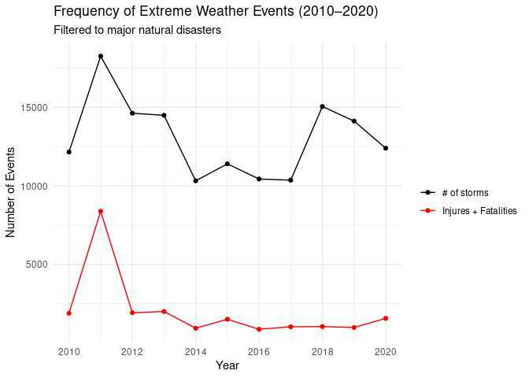

Project memo
================
Team name

This document should contain a detailed account of the data clean up for
your data and the design choices you are making for your plots. For
instance you will want to document choices you’ve made that were
intentional for your graphic, e.g. color you’ve chosen for the plot.
Think of this document as a code script someone can follow to reproduce
the data cleaning steps and graphics in your handout.

``` r
library(tidyverse)
library(broom)
library(lubridate)
library(RColorBrewer)
```

## Data Clean Up Steps for Overall Data

### Step 1: Remove all unused columns

**SHOULD WE COPY PASTE OUR DATA CLEANING FROM THE PROPOSAL?**

### Step 2: \_\_\_\_\_\_\_\_

``` r
storms <- read_csv("../data/storms.csv")
```

    ## Rows: 143621 Columns: 29
    ## ── Column specification ────────────────────────────────────────────────────────
    ## Delimiter: ","
    ## chr (10): STATE, MONTH_NAME, EVENT_TYPE, BEGIN_DATE_TIME, CZ_TIMEZONE, END_D...
    ## dbl (16): BEGIN_YEARMONTH, BEGIN_DAY, BEGIN_TIME, END_YEARMONTH, END_DAY, EN...
    ## lgl  (3): MAGNITUDE, MAGNITUDE_TYPE, CATEGORY
    ## 
    ## ℹ Use `spec()` to retrieve the full column specification for this data.
    ## ℹ Specify the column types or set `show_col_types = FALSE` to quiet this message.

``` r
storms <- storms|>
  separate(
    col = BEGIN_YEARMONTH,
    into = c("BEGIN_YEAR", "BEGIN_MONTH"),
    sep = 4,
    convert = TRUE
  )
```

``` r
storms <- storms|>
  mutate(BEGIN_DATE = as_date(BEGIN_DATE_TIME))

view(storms)
```

## Plots

### Plot 1: \_\_\_\_\_\_\_\_\_

#### Data cleanup steps specific to plot 1

These data cleaning sections are optional and depend on if you have some
data cleaning steps specific to a particular plot

``` r
storms_by_year <- storms|>
  count(BEGIN_YEAR, name = "n_events")
```

#### Final Plot 1

``` r
ggplot(storms_by_year, aes(x = BEGIN_YEAR, y = n_events)) +
  geom_line(linewidth = 1) +
  geom_point(size = 2) +
  labs(
    title = "Frequency of Extreme Weather Events (2010–2020)",
    subtitle = "Filtered to major natural disasters",
    x = "Year",
    y = "Number of Events"
  ) +
  theme_minimal()+
  scale_x_continuous(breaks = c(2010,2012,2014,2016,2018,2020))
```

<!-- -->

``` r
ggsave("storms_by_year.png")
```

    ## Saving 7 x 5 in image

### Plot 2: \_\_\_\_\_\_\_\_\_

#### Data cleaning for Plot 2

``` r
storms_by_year <- storms %>%
  count(BEGIN_YEAR, name = "n_events")

storm_casualties <- storms |> 
  rowwise(EVENT_ID)|>
  mutate(CASUALTIES = sum(c(INJURIES_DIRECT, INJURIES_INDIRECT, DEATHS_DIRECT, DEATHS_INDIRECT)))|>
  group_by(BEGIN_YEAR)|>
  summarise(casualties_year = sum(CASUALTIES))
  
casualties_storms <- left_join(storm_casualties, storms_by_year)
```

    ## Joining with `by = join_by(BEGIN_YEAR)`

#### Final Plot 1

``` r
ggplot(casualties_storms, aes(BEGIN_YEAR)) +
  geom_line(aes(y = n_events, color = "orange")) +
  geom_line(aes(y = casualties_year, color = "red"))+
  geom_point(aes(y = n_events, color = "orange")) +
  geom_point(aes(y = casualties_year, color = "red"))+
  labs(
    title = "Frequency of Extreme Weather Events (2010–2020)",
    subtitle = "Filtered to major natural disasters",
    x = "Year",
    y = "Number of Events",
    color = ""
  ) +
  theme_minimal()+
  scale_color_manual(
    values = c("orange" = "black", "red" = "red"),
    labels = c("orange" = "# of storms", "red" = "Injures + Fatalities"))+
  scale_x_continuous(breaks = c(2010,2012,2014,2016,2018,2020))
```

<!-- -->

### Plot 3: \_\_\_\_\_\_\_\_\_\_\_

Add more plot sections as needed. Each project should have at least 3
plots, but talk to me if you have fewer than 3.

### Plot 4: \_\_\_\_\_\_\_\_\_\_\_

Graph Ideas:

Line graph of all storms by year stacked line graph by storm type
