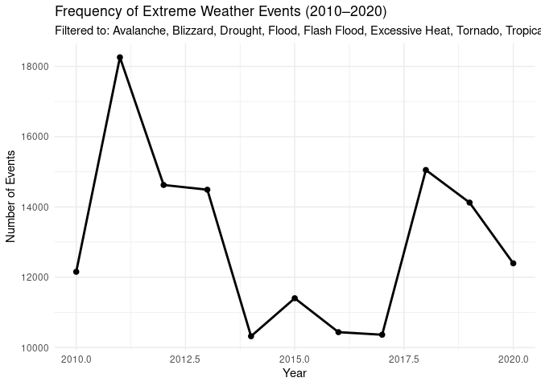
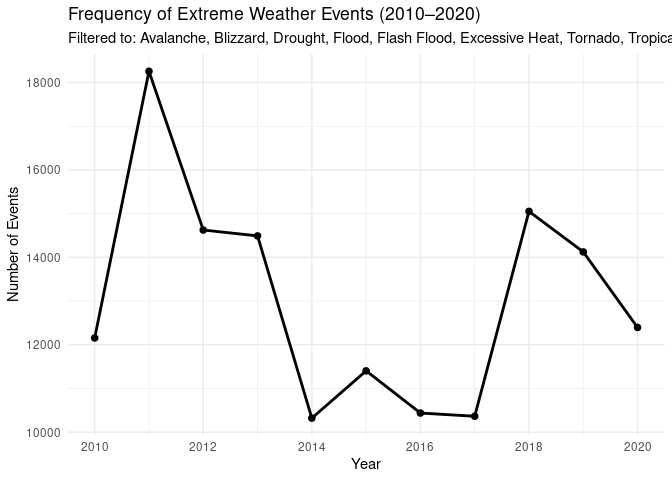

Project proposal
================
Team Weather- Colin, Kailor & Jennifer

``` r
library(tidyverse)
library(broom)
library(lubridate)
```

## 1. Introduction

The introduction should introduce your general research question(s) and
your data (where it came from, how it was collected, what are the cases,
what are the variables, etc.).

Our general research question is: Has the number of extreme weather
events in the U.S. increased from 2010-2020?

We will achieve this by simply focusing on whether the quantity of
extreme weather events in general has increased or if certain types of
extreme weather events have increased or decreased over the decade. We
can also focus on severity and if the severity of each extreme weather
event has on average increased or decreased.

Our data comes from NOAA (National Oceanic and Atmospheric
Administration) and is collected by various sources such as, trained
spotters, social media, 911 call centers, fire departments, law
enforcement, NWS (National weather service) employees, Newspapers, and
public reports.

extreme weather examples:
(“Avalanche”,“Blizzard”,“Drought”,“Flood”,“Flash Flood”,“Excessive
Heat”,“Tornado”,“Tropical Storm”,“Tsunami”,“Wildfire”

A full breakdown of each column is in the codebook, data/readme.md

Refer to the Markdown Quick Reference: Help -\> Markdown Quick
Reference.

## 2. Data

Here, we filter out observations not needed, and remove unncessary
columns.

``` r
StormEvents_2010 <- read_csv("../data/ignore/StormEvents_details-ftp_v1.0_d2010_c20250520.csv")
FiltStormEvents2010 <- StormEvents_2010|>
  filter(EVENT_TYPE %in% c("Avalanche","Blizzard","Drought","Flood","Flash Flood","Excessive Heat","Tornado","Tropical Storm","Tsunami","Wildfire"))

FiltStormEvents2010 <- FiltStormEvents2010 |>
  select(-STATE_FIPS,-CZ_TYPE,-CZ_FIPS,-CZ_NAME,-TOR_F_SCALE, -TOR_LENGTH,-TOR_WIDTH,-TOR_OTHER_WFO,-TOR_OTHER_CZ_STATE,-TOR_OTHER_CZ_FIPS,-TOR_OTHER_CZ_NAME,-BEGIN_RANGE,-BEGIN_AZIMUTH,-BEGIN_LOCATION,-END_RANGE,-END_AZIMUTH,-END_LOCATION,-EPISODE_NARRATIVE,-EVENT_NARRATIVE,-DATA_SOURCE,-WFO,-YEAR)
glimpse(FiltStormEvents2010)
```

``` r
StormEvents_2011 <- read_csv("../data/ignore/StormEvents_details-ftp_v1.0_d2011_c20250520.csv")
FiltStormEvents2011 <- StormEvents_2011|>
  filter(EVENT_TYPE %in% c("Avalanche","Blizzard","Drought","Flood","Flash Flood","Excessive Heat","Tornado","Tropical Storm","Tsunami","Wildfire"))

FiltStormEvents2011 <- FiltStormEvents2011 |>
  select(-STATE_FIPS,-CZ_TYPE,-CZ_FIPS,-CZ_NAME,-TOR_F_SCALE, -TOR_LENGTH,-TOR_WIDTH,-TOR_OTHER_WFO,-TOR_OTHER_CZ_STATE,-TOR_OTHER_CZ_FIPS,-TOR_OTHER_CZ_NAME,-BEGIN_RANGE,-BEGIN_AZIMUTH,-BEGIN_LOCATION,-END_RANGE,-END_AZIMUTH,-END_LOCATION,-EPISODE_NARRATIVE,-EVENT_NARRATIVE,-DATA_SOURCE,-WFO,-YEAR)
glimpse(FiltStormEvents2011)
```

``` r
StormEvents_2012 <- read_csv("../data/ignore/StormEvents_details-ftp_v1.0_d2012_c20250520.csv")

FiltStormEvents2012 <- StormEvents_2012|>
  filter(EVENT_TYPE %in% c("Avalanche","Blizzard","Drought","Flood","Flash Flood","Excessive Heat","Tornado","Tropical Storm","Tsunami","Wildfire"))

FiltStormEvents2012 <- FiltStormEvents2012 |>
  select(-STATE_FIPS,-CZ_TYPE,-CZ_FIPS,-CZ_NAME,-TOR_F_SCALE, -TOR_LENGTH,-TOR_WIDTH,-TOR_OTHER_WFO,-TOR_OTHER_CZ_STATE,-TOR_OTHER_CZ_FIPS,-TOR_OTHER_CZ_NAME,-BEGIN_RANGE,-BEGIN_AZIMUTH,-BEGIN_LOCATION,-END_RANGE,-END_AZIMUTH,-END_LOCATION,-EPISODE_NARRATIVE,-EVENT_NARRATIVE,-DATA_SOURCE,-WFO,-YEAR)
glimpse(FiltStormEvents2012)
```

``` r
StormEvents_2013 <- read_csv("../data/ignore/StormEvents_details-ftp_v1.0_d2013_c20250520.csv")

FiltStormEvents2013 <- StormEvents_2013|>
  filter(EVENT_TYPE %in% c("Avalanche","Blizzard","Drought","Flood","Flash Flood","Excessive Heat","Tornado","Tropical Storm","Tsunami","Wildfire"))

FiltStormEvents2013 <- FiltStormEvents2013 |>
  select(-STATE_FIPS,-CZ_TYPE,-CZ_FIPS,-CZ_NAME,-TOR_F_SCALE, -TOR_LENGTH,-TOR_WIDTH,-TOR_OTHER_WFO,-TOR_OTHER_CZ_STATE,-TOR_OTHER_CZ_FIPS,-TOR_OTHER_CZ_NAME,-BEGIN_RANGE,-BEGIN_AZIMUTH,-BEGIN_LOCATION,-END_RANGE,-END_AZIMUTH,-END_LOCATION,-EPISODE_NARRATIVE,-EVENT_NARRATIVE,-DATA_SOURCE,-WFO,-YEAR)
glimpse(FiltStormEvents2013)
```

``` r
StormEvents_2014 <- read_csv("../data/ignore/StormEvents_details-ftp_v1.0_d2014_c20250520.csv")

FiltStormEvents2014 <- StormEvents_2014|>
  filter(EVENT_TYPE %in% c("Avalanche","Blizzard","Drought","Flood","Flash Flood","Excessive Heat","Tornado","Tropical Storm","Tsunami","Wildfire"))

FiltStormEvents2014 <- FiltStormEvents2014 |>
  select(-STATE_FIPS,-CZ_TYPE,-CZ_FIPS,-CZ_NAME,-TOR_F_SCALE, -TOR_LENGTH,-TOR_WIDTH,-TOR_OTHER_WFO,-TOR_OTHER_CZ_STATE,-TOR_OTHER_CZ_FIPS,-TOR_OTHER_CZ_NAME,-BEGIN_RANGE,-BEGIN_AZIMUTH,-BEGIN_LOCATION,-END_RANGE,-END_AZIMUTH,-END_LOCATION,-EPISODE_NARRATIVE,-EVENT_NARRATIVE,-DATA_SOURCE,-WFO,-YEAR)
glimpse(FiltStormEvents2014)
```

``` r
StormEvents_2015 <- read_csv("../data/ignore/StormEvents_details-ftp_v1.0_d2015_c20250818.csv")

FiltStormEvents2015 <- StormEvents_2015|>
  filter(EVENT_TYPE %in% c("Avalanche","Blizzard","Drought","Flood","Flash Flood","Excessive Heat","Tornado","Tropical Storm","Tsunami","Wildfire"))

FiltStormEvents2015 <- FiltStormEvents2015 |>
  select(-STATE_FIPS,-CZ_TYPE,-CZ_FIPS,-CZ_NAME,-TOR_F_SCALE, -TOR_LENGTH,-TOR_WIDTH,-TOR_OTHER_WFO,-TOR_OTHER_CZ_STATE,-TOR_OTHER_CZ_FIPS,-TOR_OTHER_CZ_NAME,-BEGIN_RANGE,-BEGIN_AZIMUTH,-BEGIN_LOCATION,-END_RANGE,-END_AZIMUTH,-END_LOCATION,-EPISODE_NARRATIVE,-EVENT_NARRATIVE,-DATA_SOURCE,-WFO,-YEAR)
glimpse(FiltStormEvents2015)
```

``` r
StormEvents_2016 <- read_csv("../data/ignore/StormEvents_details-ftp_v1.0_d2016_c20250818.csv")

FiltStormEvents2016 <- StormEvents_2016|>
  filter(EVENT_TYPE %in% c("Avalanche","Blizzard","Drought","Flood","Flash Flood","Excessive Heat","Tornado","Tropical Storm","Tsunami","Wildfire"))

FiltStormEvents2016 <- FiltStormEvents2016 |>
  select(-STATE_FIPS,-CZ_TYPE,-CZ_FIPS,-CZ_NAME,-TOR_F_SCALE, -TOR_LENGTH,-TOR_WIDTH,-TOR_OTHER_WFO,-TOR_OTHER_CZ_STATE,-TOR_OTHER_CZ_FIPS,-TOR_OTHER_CZ_NAME,-BEGIN_RANGE,-BEGIN_AZIMUTH,-BEGIN_LOCATION,-END_RANGE,-END_AZIMUTH,-END_LOCATION,-EPISODE_NARRATIVE,-EVENT_NARRATIVE,-DATA_SOURCE,-WFO,-YEAR)
glimpse(FiltStormEvents2016)
```

``` r
StormEvents_2017 <- read_csv("../data/ignore/StormEvents_details-ftp_v1.0_d2017_c20250520.csv")

FiltStormEvents2017 <- StormEvents_2017|>
  filter(EVENT_TYPE %in% c("Avalanche","Blizzard","Drought","Flood","Flash Flood","Excessive Heat","Tornado","Tropical Storm","Tsunami","Wildfire"))

FiltStormEvents2017 <- FiltStormEvents2017 |>
  select(-STATE_FIPS,-CZ_TYPE,-CZ_FIPS,-CZ_NAME,-TOR_F_SCALE, -TOR_LENGTH,-TOR_WIDTH,-TOR_OTHER_WFO,-TOR_OTHER_CZ_STATE,-TOR_OTHER_CZ_FIPS,-TOR_OTHER_CZ_NAME,-BEGIN_RANGE,-BEGIN_AZIMUTH,-BEGIN_LOCATION,-END_RANGE,-END_AZIMUTH,-END_LOCATION,-EPISODE_NARRATIVE,-EVENT_NARRATIVE,-DATA_SOURCE,-WFO,-YEAR)
glimpse(FiltStormEvents2017)
```

``` r
StormEvents_2018 <- read_csv("../data/ignore/StormEvents_details-ftp_v1.0_d2018_c20250520.csv")

FiltStormEvents2018 <- StormEvents_2018|>
  filter(EVENT_TYPE %in% c("Avalanche","Blizzard","Drought","Flood","Flash Flood","Excessive Heat","Tornado","Tropical Storm","Tsunami","Wildfire"))

FiltStormEvents2018 <- FiltStormEvents2018 |>
  select(-STATE_FIPS,-CZ_TYPE,-CZ_FIPS,-CZ_NAME,-TOR_F_SCALE, -TOR_LENGTH,-TOR_WIDTH,-TOR_OTHER_WFO,-TOR_OTHER_CZ_STATE,-TOR_OTHER_CZ_FIPS,-TOR_OTHER_CZ_NAME,-BEGIN_RANGE,-BEGIN_AZIMUTH,-BEGIN_LOCATION,-END_RANGE,-END_AZIMUTH,-END_LOCATION,-EPISODE_NARRATIVE,-EVENT_NARRATIVE,-DATA_SOURCE,-WFO,-YEAR)
glimpse(FiltStormEvents2018)
```

``` r
StormEvents_2019 <- read_csv("../data/ignore/StormEvents_details-ftp_v1.0_d2019_c20250520.csv")

FiltStormEvents2019 <- StormEvents_2019|>
  filter(EVENT_TYPE %in% c("Avalanche","Blizzard","Drought","Flood","Flash Flood","Excessive Heat","Tornado","Tropical Storm","Tsunami","Wildfire"))

FiltStormEvents2019 <- FiltStormEvents2019|>
  select(-STATE_FIPS,-CZ_TYPE,-CZ_FIPS,-CZ_NAME,-TOR_F_SCALE, -TOR_LENGTH,-TOR_WIDTH,-TOR_OTHER_WFO,-TOR_OTHER_CZ_STATE,-TOR_OTHER_CZ_FIPS,-TOR_OTHER_CZ_NAME,-BEGIN_RANGE,-BEGIN_AZIMUTH,-BEGIN_LOCATION,-END_RANGE,-END_AZIMUTH,-END_LOCATION,-EPISODE_NARRATIVE,-EVENT_NARRATIVE,-DATA_SOURCE,-WFO,-YEAR)
glimpse(FiltStormEvents2019)
```

``` r
StormEvents_2020 <- read_csv("../data/ignore/StormEvents_details-ftp_v1.0_d2020_c20250702.csv")

FiltStormEvents2020 <- StormEvents_2020|>
  filter(EVENT_TYPE %in% c("Avalanche","Blizzard","Drought","Flood","Flash Flood","Excessive Heat","Tornado","Tropical Storm","Tsunami","Wildfire"))

FiltStormEvents2020 <- FiltStormEvents2020|>
  select(-STATE_FIPS,-CZ_TYPE,-CZ_FIPS,-CZ_NAME,-TOR_F_SCALE, -TOR_LENGTH,-TOR_WIDTH,-TOR_OTHER_WFO,-TOR_OTHER_CZ_STATE,-TOR_OTHER_CZ_FIPS,-TOR_OTHER_CZ_NAME,-BEGIN_RANGE,-BEGIN_AZIMUTH,-BEGIN_LOCATION,-END_RANGE,-END_AZIMUTH,-END_LOCATION,-EPISODE_NARRATIVE,-EVENT_NARRATIVE,-DATA_SOURCE,-WFO,-YEAR)
glimpse(FiltStormEvents2020)
```

``` r
storms <- rbind(FiltStormEvents2010,
                FiltStormEvents2011,
                FiltStormEvents2012,
                FiltStormEvents2013,
                FiltStormEvents2014,
                FiltStormEvents2015,
                FiltStormEvents2016,
                FiltStormEvents2017,
                FiltStormEvents2018,
                FiltStormEvents2019,
                FiltStormEvents2020)
write_csv(storms, file="../data/storms.csv")
```

``` r
# reload CSV because above chunks are eval=FALSE to avoid crashing Posit.
storms <- read_csv("../data/storms.csv")
```

    ## Rows: 143621 Columns: 29
    ## ── Column specification ────────────────────────────────────────────────────────
    ## Delimiter: ","
    ## chr (10): STATE, MONTH_NAME, EVENT_TYPE, BEGIN_DATE_TIME, CZ_TIMEZONE, END_D...
    ## dbl (16): BEGIN_YEARMONTH, BEGIN_DAY, BEGIN_TIME, END_YEARMONTH, END_DAY, EN...
    ## lgl  (3): MAGNITUDE, MAGNITUDE_TYPE, CATEGORY
    ## 
    ## ℹ Use `spec()` to retrieve the full column specification for this data.
    ## ℹ Specify the column types or set `show_col_types = FALSE` to quiet this message.

The combined storms dataset has 143621 rows and 29 columns.

## 3. Data analysis plan

The variables we will be visualizing to explore our research questions
include: 1. `BEGIN_YEAR` and `EVENT_TYPE` — to examine whether the total
number of storm events has increased from 2010 to 2020. Other type of
events are also in consider. 2. `STATE` and `EVENT_TYPE` — to identify
the differences in storm frequency or type distribution over time across
states. 3. `BEGIN_YEAR` and `DAMAGE_PROPERTY` — to indicate the severity
or financial impact events has evolved.

Other data needed: - Regional climate for exploring correlation with
event frequency.

Types of graphs we may want to use: - Stacked bar charts – to show the
distribution of `EVENT_TYPE` by `BEGIN_YEAR`. - Facet plots – to
visualize trends of each event type seperately. - Boxplots – to compare
the distributions of `DAMAGE_PROPERTY` and `INJURIES_DIRECT` by event
type. - Scatterplots with trend lines – to show relationships between
year and severity.

### Preliminary visualization examples + summary statistics

Data Cleaning

``` r
storms <- storms|>
  separate(
    col = BEGIN_YEARMONTH,
    into = c("BEGIN_YEAR", "BEGIN_MONTH"),
    sep = 4,
    convert = TRUE
  )
```

``` r
storms <- storms|>
  mutate(BEGIN_DATE = as_date(BEGIN_DATE_TIME))
```

``` r
dim(storms)
```

    ## [1] 143621     31

The combined storms dataset has 143621 rows and 31 columns.

``` r
glimpse(storms)
```

    ## Rows: 143,621
    ## Columns: 31
    ## $ BEGIN_YEAR        <int> 2010, 2010, 2010, 2010, 2010, 2010, 2010, 2010, 2010…
    ## $ BEGIN_MONTH       <int> 1, 3, 10, 10, 10, 10, 10, 8, 8, 7, 11, 10, 10, 8, 8,…
    ## $ BEGIN_DAY         <dbl> 21, 11, 1, 1, 1, 1, 1, 3, 3, 12, 30, 1, 1, 3, 3, 3, …
    ## $ BEGIN_TIME        <dbl> 300, 1816, 0, 0, 0, 0, 0, 1200, 1200, 1536, 46, 0, 0…
    ## $ END_YEARMONTH     <dbl> 201001, 201003, 201010, 201010, 201010, 201010, 2010…
    ## $ END_DAY           <dbl> 21, 16, 31, 31, 31, 31, 31, 4, 4, 12, 30, 31, 31, 4,…
    ## $ END_TIME          <dbl> 600, 830, 2359, 2359, 2359, 2359, 2359, 1800, 1800, …
    ## $ EPISODE_ID        <dbl> 36775, 36906, 45579, 45579, 45579, 45579, 45579, 444…
    ## $ EVENT_ID          <dbl> 213816, 214762, 266281, 266283, 266284, 266285, 2662…
    ## $ STATE             <chr> "FLORIDA", "IOWA", "INDIANA", "INDIANA", "INDIANA", …
    ## $ MONTH_NAME        <chr> "January", "March", "October", "October", "October",…
    ## $ EVENT_TYPE        <chr> "Flash Flood", "Flood", "Drought", "Drought", "Droug…
    ## $ BEGIN_DATE_TIME   <chr> "21-JAN-10 03:00:00", "11-MAR-10 18:16:00", "01-OCT-…
    ## $ CZ_TIMEZONE       <chr> "CST-6", "CST-6", "EST-5", "EST-5", "EST-5", "EST-5"…
    ## $ END_DATE_TIME     <chr> "21-JAN-10 06:00:00", "16-MAR-10 08:30:00", "31-OCT-…
    ## $ INJURIES_DIRECT   <dbl> 0, 0, 0, 0, 0, 0, 0, 0, 0, 0, 0, 0, 0, 0, 0, 0, 0, 0…
    ## $ INJURIES_INDIRECT <dbl> 0, 0, 0, 0, 0, 0, 0, 0, 0, 0, 0, 0, 0, 0, 0, 0, 0, 0…
    ## $ DEATHS_DIRECT     <dbl> 0, 0, 0, 0, 0, 0, 0, 0, 0, 0, 0, 0, 0, 0, 0, 0, 0, 0…
    ## $ DEATHS_INDIRECT   <dbl> 0, 0, 0, 0, 0, 0, 0, 0, 0, 0, 0, 0, 0, 0, 0, 0, 0, 0…
    ## $ DAMAGE_PROPERTY   <chr> "0.00K", "50.00K", NA, NA, NA, NA, NA, "0.00K", "0.0…
    ## $ DAMAGE_CROPS      <chr> "0.00K", "0.00K", NA, NA, NA, NA, NA, "0.00K", "0.00…
    ## $ SOURCE            <chr> "County Official", "Official NWS Observations", "Oth…
    ## $ MAGNITUDE         <lgl> NA, NA, NA, NA, NA, NA, NA, NA, NA, NA, NA, NA, NA, …
    ## $ MAGNITUDE_TYPE    <lgl> NA, NA, NA, NA, NA, NA, NA, NA, NA, NA, NA, NA, NA, …
    ## $ FLOOD_CAUSE       <chr> "Heavy Rain", "Heavy Rain / Snow Melt", NA, NA, NA, …
    ## $ CATEGORY          <lgl> NA, NA, NA, NA, NA, NA, NA, NA, NA, NA, NA, NA, NA, …
    ## $ BEGIN_LAT         <dbl> 30.9958, 42.5589, NA, NA, NA, NA, NA, NA, NA, 39.310…
    ## $ BEGIN_LON         <dbl> -87.2388, -92.5583, NA, NA, NA, NA, NA, NA, NA, -76.…
    ## $ END_LAT           <dbl> 30.9901, 42.5886, NA, NA, NA, NA, NA, NA, NA, 39.316…
    ## $ END_LON           <dbl> -87.2318, -92.7608, NA, NA, NA, NA, NA, NA, NA, -76.…
    ## $ BEGIN_DATE        <date> 2021-01-10, 2011-03-10, 2001-10-10, 2001-10-10, 200…

``` r
storms|>
  ggplot(aes(x=BEGIN_YEAR, fill=EVENT_TYPE))+
  geom_bar() +
  labs(
    title = "Total number of storm events per year",
    subtitle = "From 2010-2020",
    x = "Year",
    y = "Count",
    fill = "Storm type"
  )
```

<!-- -->

``` r
storms|>
  ggplot(aes(x=BEGIN_YEAR))+
  geom_bar() +
  facet_wrap(~EVENT_TYPE, ncol=4) +
  labs(
    title = "Total number of storm events per year",
    subtitle = "From 2010-2020",
    x = "Year",
    y = "Count"
  )
```

<!-- -->

``` r
storms_by_year <- storms %>%
  count(BEGIN_YEAR, name = "n_events")

storm_casualties <- storms |> 
  rowwise(EVENT_ID)|>
  mutate(CASUALTIES = sum(c(INJURIES_DIRECT, INJURIES_INDIRECT, DEATHS_DIRECT, DEATHS_INDIRECT)))|>
  group_by(BEGIN_YEAR)|>
  summarise(casualties_year = sum(CASUALTIES))
  
casualties_storms <- left_join(storm_casualties, storms_by_year)
```

    ## Joining with `by = join_by(BEGIN_YEAR)`

``` r
ggplot(casualties_storms, aes(BEGIN_YEAR)) +
  geom_line(aes(y = n_events, color = "Number of storms")) +
  geom_line(aes(y = casualties_year, color = "Casualties"))+
  geom_point(aes(y = n_events, color = "Number of storms"), size = 2) +
  geom_point(aes(y = casualties_year, color = "Casualties"), size = 2)+
  #geom_point(size = 2) +
  labs(
    title = "Frequency of Extreme Weather Events (2010–2020)",
    subtitle = "Filtered to: Avalanche, Blizzard, Drought, Flood, Flash Flood, Excessive Heat, Tornado, Tropical Storm, Tsunami,Wildfire",
    x = "Year",
    y = "Number of Events",
    color = ""
  ) +
  theme_minimal()+
  scale_x_continuous(breaks = c(2010,2012,2014,2016,2018,2020))
```

<!-- -->

``` r
storms_by_year <- storms %>%
  count(BEGIN_YEAR, name = "n_events")

ggplot(storms_by_year, aes(x = BEGIN_YEAR, y = n_events)) +
  geom_line(linewidth = 1) +
  geom_point(size = 2) +
  labs(
    title = "Frequency of Extreme Weather Events (2010–2020)",
    subtitle = "Filtered to: Avalanche, Blizzard, Drought, Flood, Flash Flood, Excessive Heat, Tornado, Tropical Storm, Tsunami,Wildfire",
    x = "Year",
    y = "Number of Events"
  ) +
  theme_minimal()+
  scale_x_continuous(breaks = c(2010,2012,2014,2016,2018,2020))
```

<!-- --> \`\`\`
